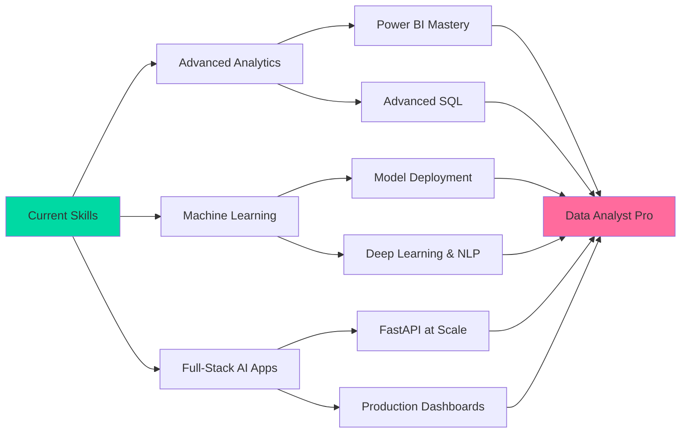

<div align="center">
  
</div>

<p align="center">
  
</p>

<p align="center">
  <a href="https://www.linkedin.com/in/arpita-sharma-9a1a381b7/">
    
  </a>
  <a href="mailto:arpitaengineer08@gmail.com">
    
  </a>
  <a href="https://github.com/arpitaengineer08-source">
    
  </a>
  <a href="https://leetcode.com/u/arpitasharma02/">
    
  </a>
  <a href="https://www.hackerrank.com/profile/arpitaengineer08">
    
  </a>
</p>

<p align="center">
  
</p>


## 💫 **ABOUT ME**

<table>
<tr>
<td width="50%" valign="top">

### 🎯 **CURRENT MISSION**

```python
arpita = {
    "name": "Arpita Sharma",
    "title": "Data Analyst Intern & AI/ML Developer",
    "education": "B.Tech CSE (Data Science & AI), SRM University",
    "location": "Shimla, Himachal Pradesh 🇮🇳",

    "working_on": [
        "Data analytics & reporting @ Labmentix",
        "End-to-end ML + BI dashboards",
        "Computer vision & NLP projects",
        "Full-stack AI-powered applications",
    ],

    "philosophy": """
    Clean the data first ✓
    Find the story in it ✓✓
    Build something people can use ✓✓✓
    """,

    "currently_exploring": {
        "data_analytics": ["EDA", "Power BI", "SQL optimisation"],
        "machine_learning": ["Deep Learning", "NLP", "Predictive modelling"],
        "full_stack": ["FastAPI", "Streamlit", "Flask"],
    },
}

print("Turning raw data into decisions, one dashboard at a time 📊")
```

</td>
<td width="50%" valign="top">

### 💭 **PHILOSOPHY & APPROACH**

<br>

> **"I don't just want a chart that looks good—**  
> **I want it to answer the question**  
> **someone actually asked."**

<br>

**My Approach:**

🔍 **Clean First** → Messy data → Trustworthy data  
🧩 **Find the Signal** → Numbers → Insight  
⚡ **Build & Ship** → Analysis → Working dashboard  
🎯 **Keep Improving** → Good → Better → Production-ready  
📚 **Explain Simply** → Technical → Understandable  

<br>

**Impact Over Buzzwords**  
Dashboards and models that answer real questions, not just look impressive.

</td>
</tr>
</table>


## 🔭 **WHAT I'M UP TO**

<div align="center">
  <table>
    <tr>
      <td width="33%" align="center">
        <br>
        <h3>🔭 CURRENTLY BUILDING</h3>
        <p align="left">
        📊 Data analytics work @ Labmentix<br>
        🧠 NeuroEase: AI mental health platform<br>
        🎬 MovieIQ Studio: ML + BI dashboard<br>
        🏏 Cricbuzz LiveStats: live API analytics
        </p>
      </td>
      <td width="33%" align="center">
        <br>
        <h3>🌱 CURRENTLY LEARNING</h3>
        <p align="left">
        📈 Advanced Power BI & dashboards<br>
        🤖 Machine Learning & Deep Learning<br>
        💬 NLP & Document AI<br>
        ⚡ FastAPI & SQL optimisation
        </p>
      </td>
      <td width="33%" align="center">
        <br>
        <h3>🤝 OPEN TO</h3>
        <p align="left">
        📊 Data Analyst internships<br>
        🤖 ML / AI internships<br>
        🌐 Open-source & research collaboration<br>
        💡 Hackathons & team projects
        </p>
      </td>
    </tr>
  </table>
</div>

<br>

| | |
|:---|:---|
| 👯 **Looking to collaborate on** | Computer vision, NLP / document AI, ML research projects and hackathon teams |
| 🤝 **Looking for help with** | Publishing my research paper, deploying ML models to production, and improving model accuracy in real-world conditions like low light |
| 💬 **Ask me about** | Python, OpenCV, MediaPipe, Flask, real-time computer vision, PDF chat assistants, hardware prototyping for hackathons |
| ⚡ **Fun fact** | I built a piano you can play in mid-air with hand gestures 🎹 and I speak English, Hindi and French 🇫🇷 |


## 🚀 **FEATURED PROJECTS**

<div align="center">

| 🧩 **Project** | 📝 **What it does** | 🧰 **Tech** |
|:---|:---|:---|
| 🧠 **NeuroEase** | AI-powered mental health platform | Python, ML |
| 🎬 **MovieIQ Studio** | ML + BI dashboard for movie insights | Python, Pandas, Streamlit |
| 🏏 **Cricbuzz LiveStats** | Live cricket analytics using APIs and SQL | Python, SQL, APIs |
| 😊 **Emotion-Based Music Player** | Reads facial emotion from webcam in real time and plays matching music | Python, OpenCV, Deep Learning |
| 🎹 **Hand Gesture Piano** | Tracks 21 hand landmarks to play a virtual piano in mid-air, sub-50ms latency | Python, OpenCV, MediaPipe |
| 📄 **AI Chat Assistant for PDFs** | Answers questions from PDFs with context-grounded responses | Python, NLP, Flask |
| 🛒 **Amazon Clone** | Full-stack e-commerce app with authentication | Flask, SQLite |

</div>


## 🛠️ **TECH STACK**

<div align="center">

### **📊 DATA & ANALYTICS**

<table>
<tr>
<td align="center" width="20%">

<br><strong>Python</strong>
</td>
<td align="center" width="20%">

<br><strong>SQL</strong>
</td>
<td align="center" width="20%">

<br><strong>Pandas</strong>
</td>
<td align="center" width="20%">

<br><strong>NumPy</strong>
</td>
<td align="center" width="20%">

<br><strong>OpenCV</strong>
</td>
</tr>
</table>


<br>

### **🤖 AI / ML**


<br>

### **⚡ BACKEND & APPS**

<table>
<tr>
<td align="center" width="20%">

<br><strong>FastAPI</strong>
</td>
<td align="center" width="20%">

<br><strong>Flask</strong>
</td>
<td align="center" width="20%">

<br><strong>SQLite</strong>
</td>
<td align="center" width="20%">

<br><strong>Firebase</strong>
</td>
<td align="center" width="20%">

<br><strong>Flutter</strong>
</td>
</tr>
</table>

<br>

### **🎨 DASHBOARDS, FRONTEND & LANGUAGES**

<table>
<tr>
<td align="center" width="20%">

<br><strong>Streamlit</strong>
</td>
<td align="center" width="20%">

<br><strong>Jupyter</strong>
</td>
<td align="center" width="20%">

<br><strong>HTML5</strong>
</td>
<td align="center" width="20%">

<br><strong>CSS3</strong>
</td>
<td align="center" width="20%">

<br><strong>C++</strong>
</td>
</tr>
</table>

<br>

### **🛠️ TOOLS**

<table>
<tr>
<td align="center" width="25%">

<br><strong>Git</strong>
</td>
<td align="center" width="25%">

<br><strong>GitHub</strong>
</td>
<td align="center" width="25%">

<br><strong>VS Code</strong>
</td>
<td align="center" width="25%">

<br><strong>Linux</strong>
</td>
</tr>
</table>

</div>


## 🎯 **EXPERTISE MATRIX**

<div align="center">

| 🎯 **Domain** | 🔥 **Key Skills** |
|:---|:---|
| **Data Analytics** | Python (Pandas, NumPy) • SQL • Power BI • Excel |
| **Machine Learning** | Predictive modelling • scikit-learn • PyTorch • Business intelligence |
| **Computer Vision & NLP** | OpenCV • MediaPipe • Document AI • Real-time tracking |
| **Backend Development** | FastAPI • Flask • SQLite • REST APIs |
| **Dashboards** | Streamlit • Jupyter Notebook |
| **Mobile Development** | Flutter • Firebase |
| **Core CS** | Data Structures • DBMS • C++ |

</div>


## 🎓 **LEARNING ROADMAP**

<div align="center">



</div>


## 🏆 **ACHIEVEMENTS & LEADERSHIP**

<div align="center">

### 🥇 Smart India Hackathon 2025: National Finalist (Hardware Edition)

Represented **Team Vajraa** at GIET University, Gunupur, in a national-level competition. Built and debugged a sensor-based prototype within 36 hours and was recognised by judges for strong execution and an innovative problem-solving approach.

### 🎤 Coordinator, AI Lytics (Coding Society), SRM University

Organising university-wide AI workshops, hackathons and seminars (Sep 2025 – Present).

</div>


## 📊 **GITHUB STATS**

<div align="center">


<br>


<br>

### 🏆 GitHub Trophies


</div>


## 💭 **PHILOSOPHY**

<div align="center">

### **"Good data analysis isn't about the fanciest model—**
### **it's about an answer someone can actually act on."**

<br>

**🎯 Core Principles:**

💎 **Clarity Over Complexity** • Simple, correct answers beat clever ones  
🔍 **Curiosity Driven** • Always asking what the data is really saying  
🚀 **Build to Ship** • Dashboards and apps people can actually use  
🤝 **Collaborate Actively** • Best insights come from asking the team

</div>


## 🤝 **LET'S CONNECT**

<div align="center">
<table>
  <tr>
    <td align="center" width="33%">
      <a href="https://www.linkedin.com/in/arpita-sharma-9a1a381b7/">
        
      </a>
      <br><sub>Professional Network</sub>
    </td>
    <td align="center" width="33%">
      <a href="mailto:arpitaengineer08@gmail.com">
        
      </a>
      <br><sub>Direct Message</sub>
    </td>
    <td align="center" width="33%">
      <a href="https://github.com/arpitaengineer08-source">
        
      </a>
      <br><sub>Code Portfolio</sub>
    </td>
  </tr>
</table>

<br>

**⭐ Star my repositories if you find them helpful!**

</div>

<div align="center">
  
</div>

<div align="center">
  <sub>Made with 💜 by <a href="https://github.com/arpitaengineer08-source">Arpita Sharma</a> • Powered by curiosity, coffee, and clean data ☕✨</sub>
</div>
